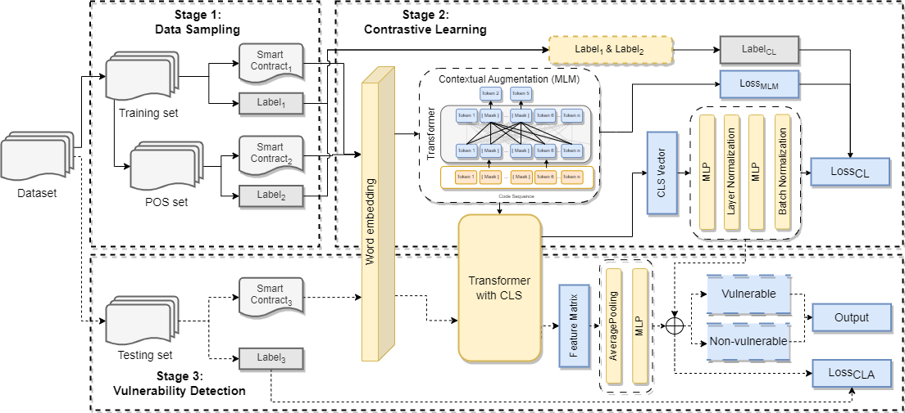

# Clear : Contrastive Learning Enhanced Automated Recognition approach for SCVs

This repo is a paper of python implementation : Contrastive Learning Enhanced Automated Recognition approach for SCVs

# Framework

The overview of our proposed method Clear is illustrated in the Figure, which consists of three modules: 1) Data Sampling, 2) Contrastive Learning, and 3) Vulnerability Detection.

# Required Packages
- python 3+
- transformers 4.26.1
- pandas 1.5.3
- pytorch 1.13.1

# Datasets
We use the same dataset as [Qian et al., 2023](https://github.com/Messi-Q/Cross-Modality-Bug-Detection). And we conduct experiments to assess reentrancy, timestamp dependence, and integer overflow/underflow vulnerabilities on the dataset.

Further instructions on the dataset can be found on [Smart-Contract-Dataset](https://github.com/Messi-Q/Smart-Contract-Dataset), which is constantly being updated to provide more details.

# Running
To run program, please use this command: python `run.py`.

Also all the hyper-parameters can be found in `run.py`.

Examples:

`
python run.py --dataset RE --epoch_clip 100  --mlmloss 0.1 --epoch_cla 20 --max_length 1024
`

